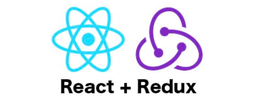

# Common-Core-Standards-Library-App
* **Front End on the app:**

* **Back End on the app:**

* **Database on the app:**

## Introduction video of the project: 
https://youtu.be/uRPCgXmS6IE

* **Purpose of the app:** 
  Utilized various client-side, server-side frameworks and SQL by emphasizing database optimization including React,
Redux, Node, Express, PostgreSQL, CSS, HTML, and JavaScript.
 Developed an e-commerce app where teachers can shop online for class assignments, worksheets, coloring activities,
posters and curriculums based on the common core state standards. The state standards are pulled from CCSS API. Teachers are also allowed to become a seller to create and sell their own teaching materials. Teachers can reach out a variety of teaching materials created and used by other fellow teachers, add their items to the shop cart. They are able to make payment through Stripe Api.
* ** Introduction video of the app:**
https://youtu.be/qeu4gulhc1s
 
