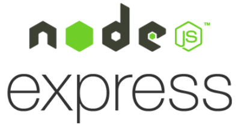

# Common-Core-Standards-Library-App
* **Front End on the app:**

* **Back End on the app:**

* **Database on the app:**

## Introduction video of the project: 
https://youtu.be/CbzyveLfOwI

* **Purpose of the app:** 
  Utilized various client-side, server-side frameworks and SQL by emphasizing database optimization including React,
Redux, Node, Express, PostgreSQL, CSS, HTML, and JavaScript.
 Developed an e-commerce app where teachers can shop online for class assignments, worksheets, coloring activities,
posters and curriculums based on the common core state standards. The state standards are pulled from CCSS API. Teachers are also allowed to become a seller to create and sell their own teaching materials. Teachers can reach out a variety of teaching materials created and used by other fellow teachers, add their items to the shop cart. They are able to make payment through Stripe Api.

## Register/Login: 
There are two user interfaces in the app. Regular buyers and sellers. When a user registers and logs in, he\she can make a search, filter products and purchase them. To be able to post and sell a product, user should be a seller. Header dropdown is adjusted based on the user type.

## Filter by Standards:
Since the main purpose of this app is searching class resources based on the common core standards, the majority of side bar filtering consists of different grades > Subjects > Standards. When user click the standard, all resources in regards to this standard will be displayed on the home page.

## Filter by Price and Resource Type:
There are 5 different type of resources and price ranges which are offered to users to make search for products. 

## Filter by Search Box:
When a seller post a product, he\she needs to enter some key words that is describing more about the resource as well as choosing standard and entering resource title. The search bar on the main page is designed to make search based on the these three components.

